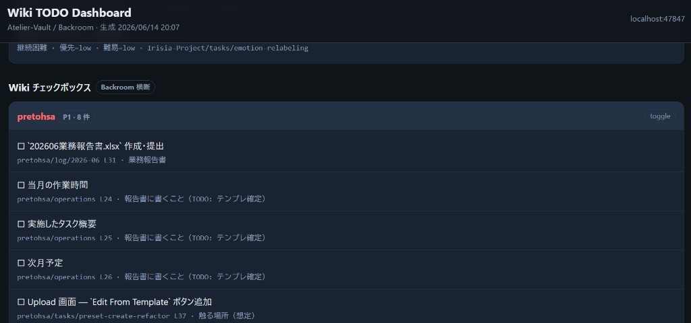

# Wiki TODO Query — Reference

## ブラウザダッシュボード

`scripts/open-dashboard.mjs` が `collect-todos.mjs` + `suggest-task.mjs` の結果を HTML にまとめる。

| 表示 | 内容 |
|------|------|
| 統計 | 未完了件数 · プロジェクト数 · タスクノート数 |
| 着手提案 | suggest-task のトップ候補 |
| タスクノート | `tasks/*.md` の frontmatter 一覧 |
| Wiki チェックボックス | Backroom 横断 `- [ ]` |

URL: `http://127.0.0.1:47847/`

### 画面例

実際の Vault（Atelier-Vault）で `@wiki-todo-query` を実行したスクリーンショットです。  
fork 後は自分の Backroom 内容が表示されます。


- プロジェクトチップ · タスクノート（`tasks/*.md`）の状態・優先度・難易度



- プロジェクト別に Backroom 横断 `- [ ]` · ノートパス・行番号付き

起動: `node .cursor/skills/wiki-todo-query/scripts/open-dashboard.mjs`

## よくあるフィルタ

```bash
node scripts/collect-todos.mjs --project sample-product
node scripts/collect-todos.mjs --format json
node scripts/collect-todos.mjs --project sample-company | head -n 40
```

## タスク frontmatter（`tasks/*.md`）

| フィールド | 値 |
|-----------|-----|
| `priority` | `high` / `medium` / `low` / `unset` |
| `difficulty` | `low` / `medium` / `high` / `unset` |
| `state` | `not-started`, `in-progress`, `blocked-by-dependency`, … |

横断台帳: `Backroom/priorities.md`  
方針: `Reference/task-management.md`

## プロジェクト優先度

`vault.config.json` の `projectPriorities` で上書き。未設定時はテンプレ既定（sample-side-work=1 等）。
