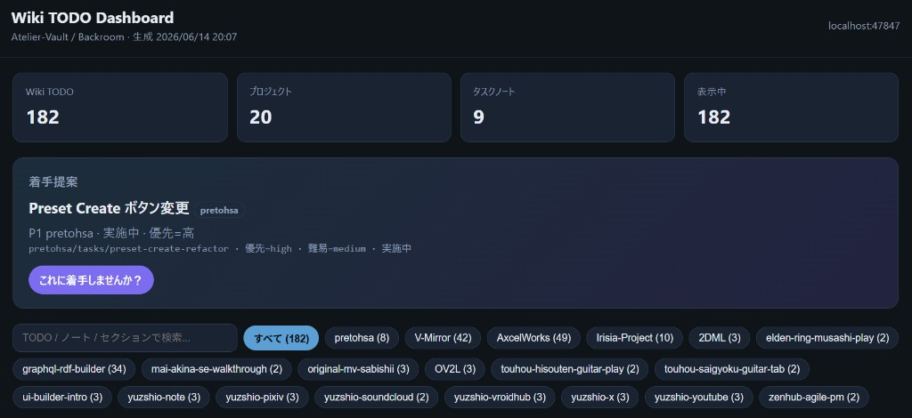
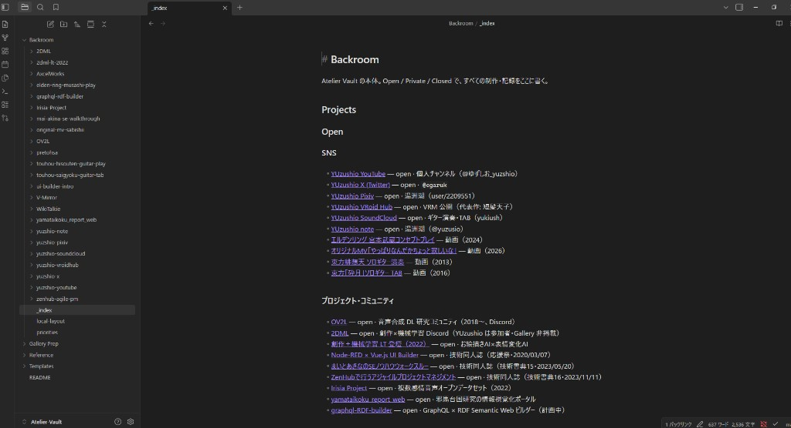
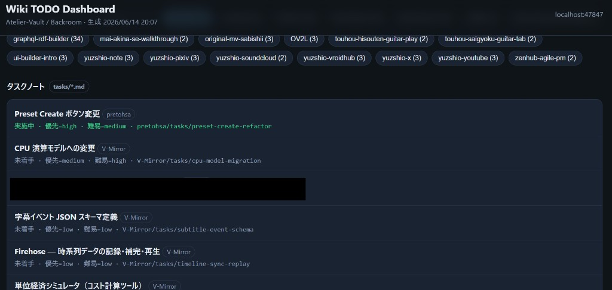

# my-atelier-vault

**English** · [日本語 (README.md)](README.md)

A self-managed Wiki template for people who work across **music · illustration · video · development · writing · books (technical doujinshi, etc.)** and juggle many projects at once.  
Write production logs and tasks in Obsidian Backroom, manage them across projects with Agent Skills (**Cursor** · **VS Code (GitHub Copilot)** · **Claude Code**).  
Comes with [Gallery](https://yuzushio.github.io/) integration — **organize your public portfolio and private work logs in one Vault**.


*Obsidian with the Vault open — projects indexed as Open / Private / Closed*



*Wiki TODO dashboard (`@wiki-todo-query`) — open counts · what to start next · per-project filters*

[](https://yuzushio.github.io/)

*Gallery — live site [yuzushio.github.io](https://yuzushio.github.io/) · template [fork on GitHub](https://github.com/YUzushio/yuzushio.github.io/fork) (`github.com/YUzushio/yuzushio.github.io`)*

Copyright (c) YUzushio · [MIT License](LICENSE)

## Who this is for

- You run **multiple domains in parallel** — music, art, video, dev, writing, doujinshi, etc.
- You **juggle several projects** — side work, day job, hobbies, OSS
- Tasks, context, and rough notes tend to **scatter across tools and folders**
- You want a **public portfolio** (Gallery) and **private work logs** (Backroom), with Wiki as the source of truth for metadata

| Layer | Role | Examples |
|-------|------|----------|
| **Backroom** | Source of truth for work (private / open / closed) | Task boards · progress logs · TODOs |
| **Gallery** | Public portfolio SPA (separate forked repo) | SNS · works · doujin · web products |
| **Vault → Gallery** | `@gallery-vault-sender` → `@gallery-vault-receiver` | Push Wiki metadata into JSON |

The Wiki TODO dashboard lists open items across projects; `@morning-briefing` helps you decide what to tackle today.

### Supported editors

| Editor | Skills location | Usage |
|--------|-----------------|-------|
| **Cursor** | [`.cursor/skills/`](.cursor/skills/) | `@wiki-setup`, etc. in chat |
| **Claude Code** | [`.claude/skills/`](.claude/skills/) (same as `.cursor/skills/`) | `@wiki-setup`, etc. in chat |
| **VS Code + GitHub Copilot** | [`.cursor/skills/*/SKILL.md`](.cursor/skills/) | Reference SKILL files in Copilot Chat |

The canonical skills live under `.cursor/skills/`. The same content is mirrored under `.claude/skills/` for Claude Code.

---

## Quick start

### 1. Fork & clone

1. [Fork on GitHub](https://github.com/YUzushio/my-atelier-vault/fork) — [github.com/YUzushio/my-atelier-vault](https://github.com/YUzushio/my-atelier-vault)
2. Clone (`<your-account>` = your GitHub username):

```bash
# macOS / Linux
git clone https://github.com/<your-account>/my-atelier-vault.git ~/my-atelier-vault
cd ~/my-atelier-vault

# Windows (PowerShell)
git clone https://github.com/<your-account>/my-atelier-vault.git C:\Users\<you>\my-atelier-vault
cd C:\Users\<you>\my-atelier-vault
```

3. Open **this folder (the cloned folder)** as the workspace in **Cursor / VS Code / Claude Code**

### 2. Setup

**A. Agent Skill (recommended)**

| Editor | Action |
|--------|--------|
| Cursor / Claude Code | Type `@wiki-setup` and follow the prompts |
| VS Code + Copilot | Reference `.cursor/skills/wiki-setup/SKILL.md` in Chat and follow the same steps |

**B. Script**

```bash
node .cursor/skills/wiki-setup/scripts/setup.mjs
```

This generates `vault.config.json` and replaces placeholders like `{{HOME_ROOT}}` under `Backroom/`.

### 3. Obsidian



1. Open **this folder (the cloned folder)** as an Obsidian vault (**Open folder as vault** · repo root, not `Backroom/`)
2. **Settings → Community plugins → Turn off restricted mode**
3. Install **Obsidian Git**
4. Set the remote to your fork URL

### 4. Wiki TODO dashboard

```bash
node .cursor/skills/wiki-todo-query/scripts/open-dashboard.mjs
```

Opens in the browser at `http://127.0.0.1:47847/`. See the overview screenshot at the top of this README.



*Task notes (`tasks/*.md`) — status · priority · difficulty*


*Cross-Backroom `- [ ]` checkboxes — note path and line number*

---

## Structure

| Path | Purpose |
|------|---------|
| `Backroom/` | Wiki body (Open / Private / Closed) |
| `Gallery Prep/` | Drafts and assets before Gallery publish (optional) |
| `Reference/` | Task management and morning-briefing sources |
| `Templates/` | Task and session-log templates, etc. |
| `.cursor/skills/` | Agent Skills (Cursor · VS Code Copilot) |
| `.claude/skills/` | Agent Skills (Claude Code · same content as above) |

### Sample projects (template)

| slug | Purpose |
|------|---------|
| `sample-open-project` | Open · Gallery listing example |
| `sample-sns-hub` | SNS hub + child work table |
| `sample-company` | Private · org knowledge |
| `sample-side-work` | Private · P1 contract work |
| `sample-product` | Private · frozen product |
| `sample-archived` | Closed · finished project |

---

## Agent Skills

In Cursor / Claude Code use `@skill-name`; in VS Code Copilot reference each `SKILL.md`.

| Skill | Purpose |
|-------|---------|
| `@wiki-setup` | First-time setup after fork |
| `@wiki-setup-advanced` | **Optional** — Google Calendar / GitLab / GitHub MCP |
| `@wiki-todo-query` | Cross-Backroom TODOs · dashboard |
| `@gallery-vault-sender` | Wiki → Gallery sender-side metadata |
| `@morning-briefing` | Morning briefing |

### Advanced MCP (optional)

After basic setup, if needed:

```bash
node .cursor/skills/wiki-setup-advanced/scripts/setup-advanced.mjs
```

**Skipping is fine by default.** Guides Calendar · GitLab · GitHub MCP setup (Cursor / Claude Code MCP; Copilot extensions via each editor’s settings UI).

---

## Gallery integration

The public portfolio SPA lives in a **separate repo**.

| | URL |
|---|-----|
| **Fork template (GitHub repo)** | [github.com/YUzushio/yuzushio.github.io](https://github.com/YUzushio/yuzushio.github.io) · [fork](https://github.com/YUzushio/yuzushio.github.io/fork) |
| **Live site (GitHub Pages)** | [yuzushio.github.io](https://yuzushio.github.io/) |

### Flow

1. **Sender (this repo):** `@gallery-vault-sender` — set `gallery: true` on `Backroom/{slug}/_index.md`
2. **Receiver (Gallery repo):** `@gallery-vault-receiver` — merge into `public/data/gallery.json`

---

## Configuration

| File | Description |
|------|-------------|
| `vault.config.example.json` | Committed template |
| `vault.config.json` | Personal settings (**gitignored**) |

---

## License

MIT License — Copyright (c) YUzushio. See [LICENSE](LICENSE).
