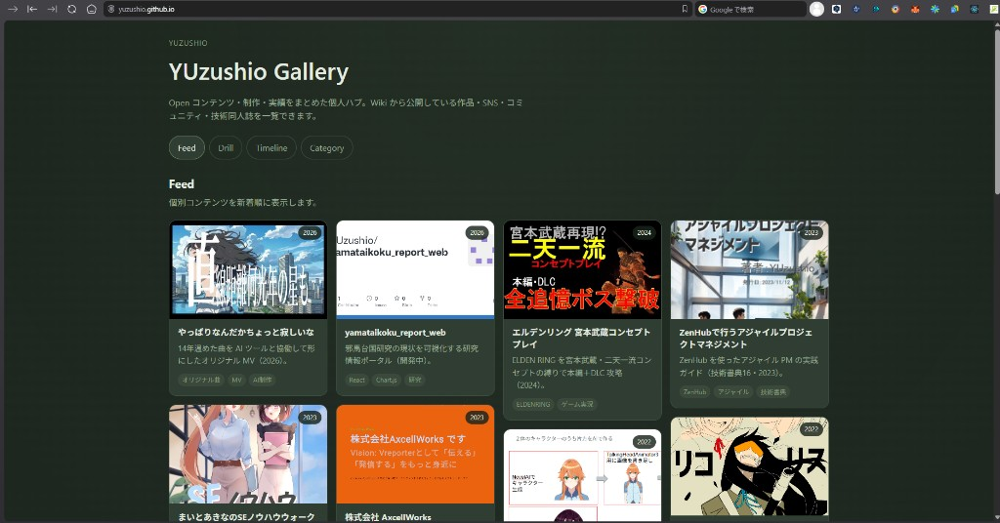

# my-atelier-vault

**様々な分野・プロジェクトに手を出す人向け**の、自己作業管理 Wiki テンプレートです。  
Obsidian で Backroom に制作ログ・タスクを書き、Agent Skills（**Cursor** · **VS Code（GitHub Copilot）** · **Claude Code**）で横断管理。  
[Gallery](https://github.com/YUzushio/yuzushio.github.io) 連携機能付き — **個人ポートフォリオと作業管理をひとつの Vault で整理できる**のが強みです。

[](https://yuzushio.github.io/)

*Gallery 公開例（[yuzushio.github.io](https://yuzushio.github.io/)）— Wiki の `gallery: true` プロジェクトを Feed / Drill / Timeline / Category で一覧。テンプレ fork: [YUzushio/yuzushio.github.io](https://github.com/YUzushio/yuzushio.github.io)*

- **テンプレリポ:** このリポジトリ（`YUzushio/my-atelier-vault`）
- **作者の private 正本:** 別リポ [`atelier-vault`](https://github.com/YUzushio/atelier-vault)（非公開運用想定）

Copyright (c) YUzushio · [MIT License](LICENSE)

## こんな人向け

- 副業・本業・趣味・OSS など **複数プロジェクトを並行**している
- タスク・経緯・未整理メモが **ツールやフォルダに散らばりがち**
- **公開用ポートフォリオ**（Gallery）と **非公開の作業ログ**（Backroom）を分けつつ、メタデータは Wiki を正本にしたい

| 層 | 役割 | 例 |
|----|------|-----|
| **Backroom** | 作業管理の正本（private / open / closed） | タスク台帳 · 進捗ログ · TODO |
| **Gallery** | 公開ポートフォリオ（fork 別リポ） | SNS · 作品 · 同人 · Web プロダクト |
| **Vault → Gallery** | `@gallery-vault-sender` → `@gallery-vault-receiver` | Wiki で整えたメタを JSON に反映 |

Wiki TODO ダッシュボードでプロジェクト横断の未完了を一覧し、朝ブリーフィング（`@morning-briefing`）で「今日何に着手するか」までつなげられます。

### 対応エディタ

| エディタ | Skills の場所 | 使い方 |
|---------|--------------|--------|
| **Cursor** | [`.cursor/skills/`](.cursor/skills/) | チャットで `@wiki-setup` 等 |
| **Claude Code** | [`.claude/skills/`](.claude/skills/)（`.cursor/skills/` と同内容） | チャットで `@wiki-setup` 等 |
| **VS Code + GitHub Copilot** | [`.cursor/skills/*/SKILL.md`](.cursor/skills/) | Copilot Chat で SKILL を `@` 参照、またはファイルパスを指定 |

Skills の正本は `.cursor/skills/` です。Claude Code 向けに `.claude/skills/` へ同じ内容を置いています。

---

## Quick start

### 1. Fork & clone

1. [YUzushio/my-atelier-vault](https://github.com/YUzushio/my-atelier-vault) を GitHub で **fork**
2. clone して **Cursor / VS Code / Claude Code** および **Obsidian** で開く

### 2. セットアップ

**A. Agent Skill（推奨）**

| エディタ | 操作 |
|---------|------|
| Cursor / Claude Code | `@wiki-setup` と入力し、対話に従う |
| VS Code + Copilot | `.cursor/skills/wiki-setup/SKILL.md` を Chat で参照し、同手順を実行 |

**B. スクリプト**

```bash
node .cursor/skills/wiki-setup/scripts/setup.mjs
```

`vault.config.json` が生成され、`Backroom/` の `{{HOME_ROOT}}` 等が置換されます。

### 3. Obsidian

1. このフォルダを vault として開く
2. **Settings → Community plugins → Turn off restricted mode**
3. **Obsidian Git** をインストール
4. Remote を自分の fork URL に設定

### 4. Wiki TODO ダッシュボード

```bash
node .cursor/skills/wiki-todo-query/scripts/open-dashboard.mjs
```

`http://127.0.0.1:47847/` でブラウザ表示。

| 画面 | 内容 |
|------|------|
| タスクノート |  |
| Wiki チェックボックス |  |

---

## Structure

| パス | 用途 |
|------|------|
| `Backroom/` | Wiki 本体（Open / Private / Closed） |
| `Gallery Prep/` | Gallery 公開前の下書き・素材（任意） |
| `Reference/` | タスク管理・朝ブリーフィング情報源 |
| `Templates/` | タスク・セッションログ等 |
| `.cursor/skills/` | Agent Skills（Cursor · VS Code Copilot 参照用） |
| `.claude/skills/` | Agent Skills（Claude Code 用 · 上記と同内容） |

### サンプルプロジェクト（テンプレ）

| slug | 用途 |
|------|------|
| `sample-open-project` | Open · Gallery 掲載例 |
| `sample-sns-hub` | SNS hub + 子 work 表 |
| `sample-company` | Private · 組織ナレッジ |
| `sample-side-work` | Private · P1 委託 |
| `sample-product` | Private · frozen プロダクト |
| `sample-archived` | Closed · 終了プロジェクト |

---

## Agent Skills

Cursor · Claude Code では `@skill名`、VS Code Copilot では各 `SKILL.md` を参照。

| Skill | 用途 |
|-------|------|
| `@wiki-setup` | fork 直後の初回セットアップ |
| `@wiki-setup-advanced` | **任意** — Google Calendar / GitLab / GitHub MCP 連携 |
| `@wiki-todo-query` | Backroom 横断 TODO · ダッシュボード |
| `@gallery-vault-sender` | Wiki → Gallery 送信側メタ整備 |
| `@morning-briefing` | おはようブリーフィング |

### Advanced MCP（任意）

基本セットアップ後、必要な場合のみ:

```bash
node .cursor/skills/wiki-setup-advanced/scripts/setup-advanced.mjs
```

デフォルトは **スキップで OK**。Calendar · GitLab · GitHub の MCP 設定を案内します（Cursor / Claude Code の MCP、Copilot 拡張機能は各エディタの設定 UI から）。

---

## Gallery 連携

公開ポートフォリオ SPA は **別リポ** です。

| | URL |
|---|-----|
| **Fork テンプレ** | [github.com/YUzushio/yuzushio.github.io](https://github.com/YUzushio/yuzushio.github.io) |
| **公開例** | [yuzushio.github.io](https://yuzushio.github.io/) |

### フロー

1. **Sender（このリポ）:** `@gallery-vault-sender` — `Backroom/{slug}/_index.md` に `gallery: true`
2. **Receiver（Gallery リポ）:** `@gallery-vault-receiver` — `public/data/gallery.json` にマージ

---

## Configuration

| ファイル | 説明 |
|---------|------|
| `vault.config.example.json` | コミット済みテンプレ |
| `vault.config.json` | 個人設定（**gitignore**） |

---

## License

MIT License — Copyright (c) YUzushio. See [LICENSE](LICENSE).
